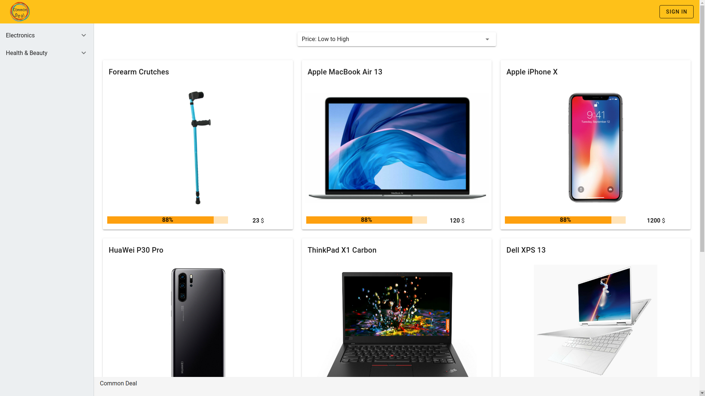
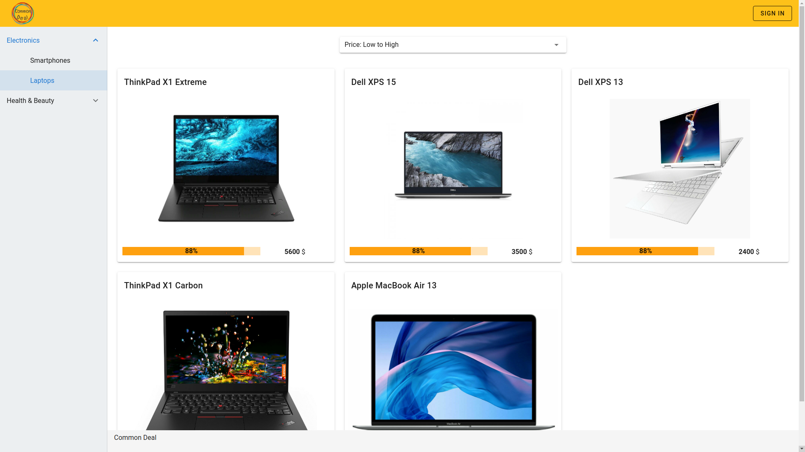
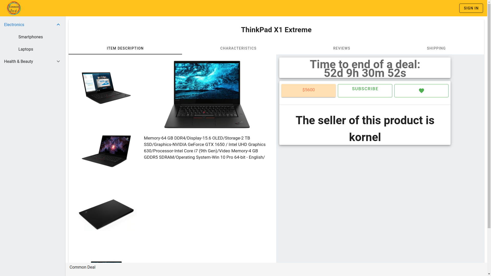
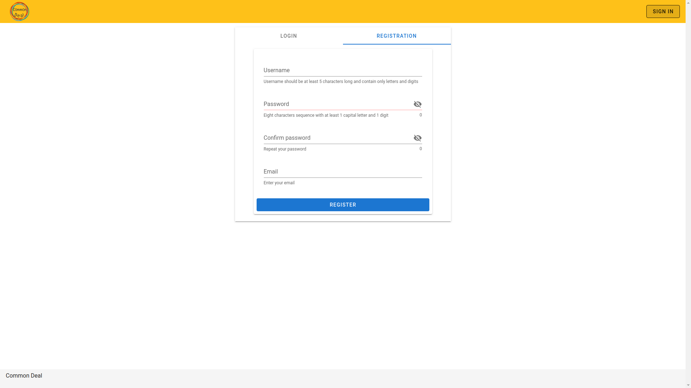
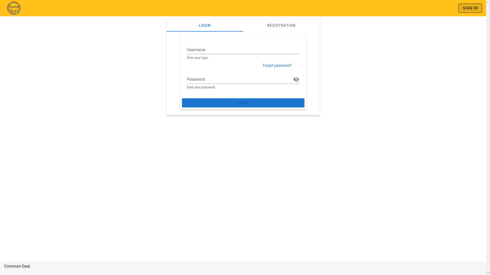

# Common-Deal
Online platform to associate vendors with a group of customers. Vendor agrees that if sufficient amount of potential customers will gather, he's going to sell the product for a wholesale price. The purpose of this project was to practice MVC pattern, separating back and frontend, managing database resources through ORM and to finally deploy it on the Microsoft Azure cloud service.

## Screenshots
1. Home page - product list:

2. Filtering offers by product category:

3. Product detail view:

4. User registration:

5. User login:

## Tech Stack
- Python
- Django / Django REST Framework
- Vue.js
- Vuetify
- PostgreSQL
- Microsoft Azure

## Goals
The purpose of this project was to practice following subjects:
- handling HTTP requests with Django REST Framework for different HTTP methods,
- user authentication, authorization and permissions using JWT Token,
- managing database records and relationships through Django ORM,
- how to use JSON field in a model class to store object's attributes,
- how to handle files upload,
- data serialization,
- API endpoints testing,
- setting up of Sendgrid Email API to send user registration confirmation and password reset emails, 
- integration of the separate presentation and data access layer,
- how to use views and components in Vue.js,
- route/ view mapping using Vue Router,
- how to pass data between components,
- how to emit signals in Vue.js,
- asynchronous request handling,
- how to use instance lifecycle hooks,
- events handling,
- differentiate styles and components for mobile and desktop devices,
- user input validation on front and back end,
- how to build applications using Vuetify - material design component framework for Vue.js,
- deployment on Microsoft Azure.

## Implemented Features
- user registration, login, logout and password recovery,
- product list view,
- sorting items by price,
- filtering products by category,
- product detail view,
- admin site to manage database resources.

## Development plans
- limiting customer access to offers only if one meets certain requirements,
- adding new products/offers,
- calculate current number of subscribtions left to finalize the offer,
- integration with Inpost API to choose a pick up parcel locker,
- integration with PayPal as a payment method,
- searchbar,
- filtering products by their attributes.

## Setup
Please note that this project uses Sendgrid services. You may need to create your own account to make this project work properly.
You will have to install Node.js if you don't have it yet.
- install packages from `requirements.txt`,
- create a database,
- create a `.env` file in `common_deal` directory to store environment variables,
- define following variables in `.env` file to establish connection with the database:
  - `DATABASE_NAME`,
  - `USER_NAME`,
  - `USER_PASSWORD`,
  - `SENDGRID_API_KEY`,
- create migrations with `python manage.py makemigrations`,
- apply migrations with `python manage.py migrate`,
- you may want to create a super user to get access to admin panel `python manage.py createsuperuser`,
- run Django server with `python manage.py runserver`,
- then change directory to `/frontend` and run Node.js server with `npm run serve`.
